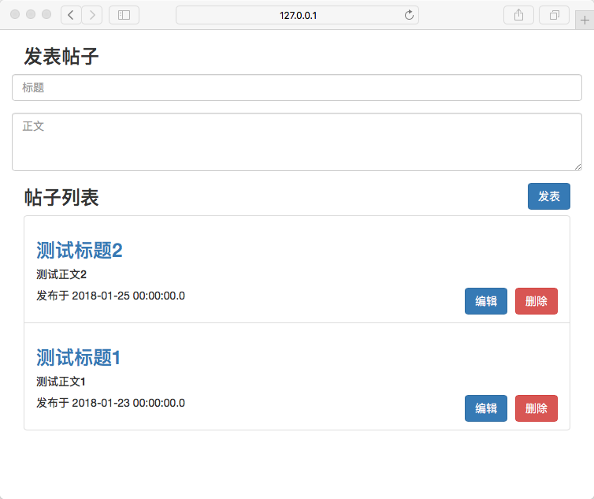
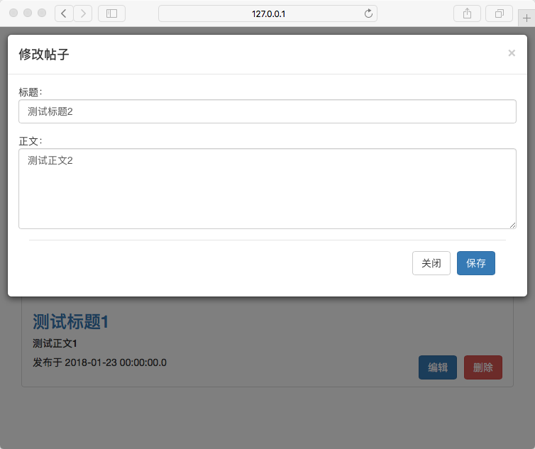

# Spring Boot + MyBatis + Thymeleaf实现简单留言板应用

本项目主要介绍使用Spring Boot + MyBatis + Thymeleaf + Bootstrap来实现一个简单的增删改查（CRUD）留言板应用。高阶人士可以直接跳过。

本教程源代码：[https://github.com/qingwenwei/spring-boot-crud-example](https://github.com/qingwenwei/spring-boot-crud-example)

## 功能介绍

发表帖子、帖子列表



编辑帖子



## 使用Spring Initializr构建项目
Spring Initializr是一个基于web的快速构建Spring Boot项目的工具。

1. 登录[https://start.spring.io](https://start.spring.io)
2. 选择需要的依赖。
3. 点击Generate Project下载项目压缩包。


## 导入项目
本教程使用eclipse作为IDE。

1. 解压压缩包。
2. 导入项目，如下图。
3. 选择项目根目录（pom.xml文件所在的目录）。


## 配置MySQL数据库
在本地MySQL数据库创建用户名为```root```密码为```root```的用户。

创建一个名为```crudDemoDB```空的数据库（schema），使用UTF8编码格式是为了对汉字存储更友好：

```
CREATE DATABASE crudDemoDB CHARACTER SET utf8mb4 COLLATE utf8mb4_unicode_ci;
```

## 配置文件 
maven依赖管理配置文件：```pom.xml```

```
<?xml version="1.0" encoding="UTF-8"?>
<project xmlns="http://maven.apache.org/POM/4.0.0" xmlns:xsi="http://www.w3.org/2001/XMLSchema-instance"
	xsi:schemaLocation="http://maven.apache.org/POM/4.0.0 http://maven.apache.org/xsd/maven-4.0.0.xsd">
	<modelVersion>4.0.0</modelVersion>

	<groupId>com.example</groupId>
	<artifactId>demo</artifactId>
	<version>0.0.1-SNAPSHOT</version>
	<packaging>jar</packaging>

	<name>demo</name>
	<description>Demo project for Spring Boot</description>

	<parent>
		<groupId>org.springframework.boot</groupId>
		<artifactId>spring-boot-starter-parent</artifactId>
		<version>2.0.1.RELEASE</version>
		<relativePath/> <!-- lookup parent from repository -->
	</parent>

	<properties>
		<project.build.sourceEncoding>UTF-8</project.build.sourceEncoding>
		<project.reporting.outputEncoding>UTF-8</project.reporting.outputEncoding>
		<java.version>1.8</java.version>
	</properties>

	<dependencies>
		<dependency>
			<groupId>org.springframework.boot</groupId>
			<artifactId>spring-boot-starter-thymeleaf</artifactId>
		</dependency>
		<dependency>
			<groupId>org.springframework.boot</groupId>
			<artifactId>spring-boot-starter-web</artifactId>
		</dependency>
		<dependency>
			<groupId>org.mybatis.spring.boot</groupId>
			<artifactId>mybatis-spring-boot-starter</artifactId>
			<version>1.3.2</version>
		</dependency>

		<dependency>
			<groupId>mysql</groupId>
			<artifactId>mysql-connector-java</artifactId>
			<scope>runtime</scope>
		</dependency>
		<dependency>
			<groupId>org.springframework.boot</groupId>
			<artifactId>spring-boot-starter-test</artifactId>
			<scope>test</scope>
		</dependency>
	</dependencies>

	<build>
		<plugins>
			<plugin>
				<groupId>org.springframework.boot</groupId>
				<artifactId>spring-boot-maven-plugin</artifactId>
			</plugin>
		</plugins>
	</build>

</project>
```

Spring Boot应用的配置文件：```src/main/resources/application.properties```

```
# database
spring.datasource.driverClassName = com.mysql.jdbc.Driver
spring.datasource.url = jdbc:mysql://localhost:3306/crudDemoDB?useSSL=false&useUnicode=true&characterEncoding=UTF-8
spring.datasource.username = root
spring.datasource.password = root
spring.datasource.initialization-mode=always

# MyBatis
mybatis.type-aliases-package=com.example.demo.model
mybatis.config-locations=classpath:mybatis/mybatis-config.xml
mybatis.mapper-locations=classpath:mybatis/mapper/*.xml

# thymeleaf
spring.thymeleaf.cache=false
spring.thymeleaf.mode=HTML
```

## MyBatis

在```resources```下新建目录```mybatis```，```mybatis```下新建目录```mapper```。同时，添加以下两个文件。

MyBatis的配置文件：```src/main/resources/mybatis/mybatis-config.xml```

```
<?xml version="1.0" encoding="UTF-8" ?>
<!DOCTYPE configuration PUBLIC "-//mybatis.org//DTD Config 3.0//EN" "http://mybatis.org/dtd/mybatis-3-config.dtd">
<configuration>
    <typeAliases>
        <typeAlias alias="Integer" type="java.lang.Integer" />
        <typeAlias alias="Long" type="java.lang.Long" />
        <typeAlias alias="String" type="java.lang.String" />
        <typeAlias alias="HashMap" type="java.util.HashMap" />
        <typeAlias alias="Date" type="java.util.Date" />
        <typeAlias alias="LinkedHashMap" type="java.util.LinkedHashMap" />
        <typeAlias alias="ArrayList" type="java.util.ArrayList" />
        <typeAlias alias="LinkedList" type="java.util.LinkedList" />
    </typeAliases>
</configuration>
```

Mapper文件：```src/main/resources/mybatis/mapper/PostMapper.xml```

```
<?xml version="1.0" encoding="UTF-8" ?>
<!DOCTYPE mapper PUBLIC "-//mybatis.org//DTD Mapper 3.0//EN" "http://mybatis.org/dtd/mybatis-3-mapper.dtd">
<mapper namespace="com.example.demo.dao.PostDao">

	<resultMap id="PostResultMap" type="com.example.demo.model.Post">
        <id property="id" column="post_id"/>
        <result property="title" column="post_title"/>
        <result property="content" column="post_content"/>
        <result property="creationDate" column="post_creation_date"/>
    </resultMap>

	<insert id="save">
        INSERT INTO `T_POST` (title, content, creationDate) VALUES (#{title}, #{content}, #{creationDate})
    </insert>
    
    <select id="findAll" resultMap="PostResultMap">
        SELECT
            p.id as post_id,
            p.title as post_title,
            p.content as post_content,
            p.creationDate as post_creation_date
        FROM T_POST p
        ORDER BY p.creationDate DESC
    </select>
    
    <select id="find" resultMap="PostResultMap">
        SELECT
            p.id as post_id,
            p.title as post_title,
            p.content as post_content,
            p.creationDate as post_creation_date
        FROM T_POST p
        WHERE p.id = #{postId}
    </select>
	
	<update id="update" parameterType="com.example.demo.model.Post">
        UPDATE T_POST SET 
	        title = #{title},
	        content = #{content}
        WHERE id = #{id}
    </update>
	
	<delete id="delete" parameterType="Long">
        DELETE FROM T_POST WHERE id = #{postId}
    </delete>
</mapper>
```

## DAO层

Dao接口的方法需要与上面Mapper对应。

```src/main/java/com/example/demo/dao/PostDao.java```

```
package com.example.demo.dao;

import java.util.List;

import org.apache.ibatis.annotations.Mapper;

import com.example.demo.model.Post;

@Mapper
public interface PostDao {
	
	void save(Post post);
	
	void delete(Long postId);
	
	void update(Post post);
	
	Post find(Long postId);
	
	List<Post> findAll();
	
}
```

## 实体类

```src/main/java/com/example/demo/model/Post.java```

```
package com.example.demo.model;

import java.io.Serializable;
import java.sql.Timestamp;

public class Post implements Serializable {
	
	private static final long serialVersionUID = 1L;
	
	private Long id;
	private String title;
	private String content;
	private Timestamp creationDate;
    
	public Long getId() {
		return id;
	}
	
	public void setId(Long id) {
		this.id = id;
	}
	
	public String getTitle() {
		return title;
	}
	
	public void setTitle(String title) {
		this.title = title;
	}
	
	public String getContent() {
		return content;
	}
	
	public void setContent(String content) {
		this.content = content;
	}
	
	public Timestamp getCreationDate() {
		return creationDate;
	}
	
	public void setCreationDate(Timestamp creationDate) {
		this.creationDate = creationDate;
	}

	@Override
	public String toString() {
		return "Post [id=" + id + ", title=" + title + ", content=" + content + ", creationDate=" + creationDate + "]";
	}
    
}

```

## 业务逻辑层

接口设计

```src/main/java/com/example/demo/service/PostService.java```

```
package com.example.demo.service;

import java.util.Map;

import com.example.demo.model.Post;

public interface PostService {

	void createPost(Post post);
	
	void deletePost(Long postId);
	
	void updatePost(Post post);
	
	Map<String, Object> findPost(Long postId);
	
	Map<String, Object> findAllPosts();
	
}
```

具体实现

```src/main/java/com/example/demo/service/impl/PostServiceImpl.java```

```
package com.example.demo.service.impl;

import java.sql.Timestamp;
import java.util.HashMap;
import java.util.List;
import java.util.Map;

import org.springframework.beans.factory.annotation.Autowired;
import org.springframework.stereotype.Service;
import org.springframework.transaction.annotation.Transactional;

import com.example.demo.dao.PostDao;
import com.example.demo.model.Post;
import com.example.demo.service.PostService;

@Service("postService")
@Transactional
public class PostServiceImpl implements PostService{

	@Autowired
	private PostDao postDao;

	@Override
	public void createPost(Post post) {
		post.setCreationDate(new Timestamp(System.currentTimeMillis()));
		this.postDao.save(post);
	}

	@Override
	public void deletePost(Long postId) {
		this.postDao.delete(postId);
	}

	@Override
	public void updatePost(Post post) {
		this.postDao.update(post);
	}
	
	@Override
	public Map<String, Object> findPost(Long postId) {
		Map<String, Object> attributes = new HashMap<>();
		Post post = this.postDao.find(postId);
		attributes.put("post", post);
		return attributes;
	}
	
	@Override
	public Map<String, Object> findAllPosts() {
		Map<String, Object> attributes = new HashMap<>();
		List<Post> allPosts = this.postDao.findAll();
		// all posts
		attributes.put("posts", allPosts);
		// provide a new data transfer object
		attributes.put("postDto", new Post());
		return attributes;
	}
	
}
```

## 控制器

```src/main/java/com/example/demo/controller/PostController.java```

```
package com.example.demo.controller;

import java.util.Map;

import javax.validation.Valid;

import org.slf4j.Logger;
import org.slf4j.LoggerFactory;
import org.springframework.beans.factory.annotation.Autowired;
import org.springframework.stereotype.Controller;
import org.springframework.ui.Model;
import org.springframework.web.bind.annotation.ModelAttribute;
import org.springframework.web.bind.annotation.PathVariable;
import org.springframework.web.bind.annotation.RequestMapping;
import org.springframework.web.bind.annotation.RequestMethod;

import com.example.demo.model.Post;
import com.example.demo.service.PostService;

@Controller
public class PostController {
	
	public static final Logger logger = LoggerFactory.getLogger(PostController.class);
	
	@Autowired
	private PostService postService;
	
	/*
	 * Create a new post
	 */
	@RequestMapping(value = "/posts", method = RequestMethod.POST)
	public String createPost(Model model, @Valid @ModelAttribute("postDto") Post post) {
		logger.info("Creating post >> " + post);
		this.postService.createPost(post);
		return "redirect:/posts";
	}
	
	/*
	 * Delete a post
	 */
	@RequestMapping(value = "/posts/{postId}", method = RequestMethod.DELETE)
	public String deletePost(@PathVariable("postId") Long postId) {
		logger.info("Deleting post id:" + postId);
		this.postService.deletePost(postId);
		return "redirect:/posts";
	}
	
	/*
	 * Update a post
	 */
	@RequestMapping(value = "/posts", method = RequestMethod.PUT)
	public String updatePost(@Valid @ModelAttribute("postDto") Post post) {
		logger.info("Updating post >> " + post);
		this.postService.updatePost(post);
		return "redirect:/posts";
	}
	
	/*
	 * List all posts
	 */
	@RequestMapping(value = "/posts", method = RequestMethod.GET)
	public String listAllPosts(Model model) {
		logger.info("Litsing all posts...");
		Map<String, Object> attributes = this.postService.findAllPosts();
		model.addAllAttributes(attributes);
		return "post-index";
	}
	
	/*
	 * Display post details
	 */
	@RequestMapping(value = "/posts/{postId}", method = RequestMethod.GET)
	public String displayPostDetails(Model model, @PathVariable("postId") Long postId) {
		logger.info("Displaying post details >> postId: " + postId);
		Map<String, Object> attributes = this.postService.findPost(postId);
		model.addAllAttributes(attributes);
		return "post-details";
	}
	
}
```

## Spring Boot入口类

```src/main/java/com/example/demo/DemoApplication.java```

```
package com.example.demo;

import org.springframework.boot.SpringApplication;
import org.springframework.boot.autoconfigure.SpringBootApplication;

@SpringBootApplication
public class DemoApplication {
	
	public static void main(String[] args) {
		SpringApplication.run(DemoApplication.class, args);
	}
}
```

## SQL脚本

Spring Boot在运行时会检查在```resources```目录下是否有名为```schema.sql```和```data.sql```的两个SQL脚本文件，并且在数据库连接池建立后执行这两个文件。

```src/main/resources/schema.sql```

```
DROP TABLE IF EXISTS `T_POST`;

CREATE TABLE `T_POST`(
  `id`                 	BIGINT			NOT NULL AUTO_INCREMENT,
  `title`              	VARCHAR(255)	NOT NULL,
  `content`				TEXT,
  `creationDate`		DATETIME,
  PRIMARY KEY (`id`)
);
```

```src/main/resources/data.sql```

```
INSERT INTO `T_POST` (title, content, creationDate) VALUES ('测试标题1', '测试正文1', '2018-01-23');
INSERT INTO `T_POST` (title, content, creationDate) VALUES ('测试标题2', '测试正文2', '2018-01-25');
```

## 前端页面

前端页面代码在这里就不一一贴出来了。感兴趣的朋友可以下载项目代码来看看。

帖子列表页面

```src/main/resources/templates/post-index.html```

帖子内容

```src/main/resources/templates/post-details.html```

通过CDN导入bootstrap和jQuery

```src/main/resources/templates/head.html```

## 源代码

本教程源代码：[https://github.com/qingwenwei/spring-boot-crud-example](https://github.com/qingwenwei/spring-boot-crud-example)
