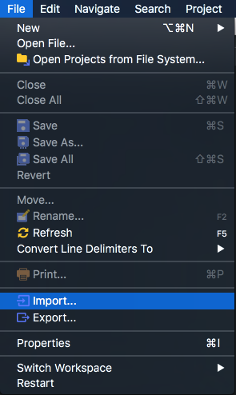
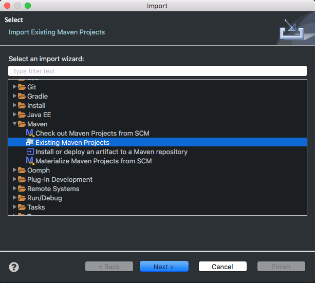

#Spring Boot + MyBatis + Thymeleaf实现简单留言板应用

本文主要介绍使用Spring Boot + MyBatis + Thymeleaf + Bootstrap来实现一个简单的增删改查（CRUD）留言板应用。

##使用Spring Initializr构建项目
Spring Initializr是一个基于web的快速构建Spring Boot项目的工具。

1. 登录[https://start.spring.io](https://start.spring.io)
2. 选择需要的依赖。
3. 点击Generate Project下载项目压缩包。


##导入项目
本教程使用eclipse作为IDE。

1. 解压压缩包。
2. 导入项目，如下图。
3. 选择项目根目录（pom.xml文件所在的目录）。




##pom.xml文件
```
<?xml version="1.0" encoding="UTF-8"?>
<project xmlns="http://maven.apache.org/POM/4.0.0" xmlns:xsi="http://www.w3.org/2001/XMLSchema-instance"
	xsi:schemaLocation="http://maven.apache.org/POM/4.0.0 http://maven.apache.org/xsd/maven-4.0.0.xsd">
	<modelVersion>4.0.0</modelVersion>

	<groupId>com.example</groupId>
	<artifactId>demo</artifactId>
	<version>0.0.1-SNAPSHOT</version>
	<packaging>jar</packaging>

	<name>demo</name>
	<description>Demo project for Spring Boot</description>

	<parent>
		<groupId>org.springframework.boot</groupId>
		<artifactId>spring-boot-starter-parent</artifactId>
		<version>2.0.1.RELEASE</version>
		<relativePath/> <!-- lookup parent from repository -->
	</parent>

	<properties>
		<project.build.sourceEncoding>UTF-8</project.build.sourceEncoding>
		<project.reporting.outputEncoding>UTF-8</project.reporting.outputEncoding>
		<java.version>1.8</java.version>
	</properties>

	<dependencies>
		<dependency>
			<groupId>org.springframework.boot</groupId>
			<artifactId>spring-boot-starter-thymeleaf</artifactId>
		</dependency>
		<dependency>
			<groupId>org.springframework.boot</groupId>
			<artifactId>spring-boot-starter-web</artifactId>
		</dependency>
		<dependency>
			<groupId>org.mybatis.spring.boot</groupId>
			<artifactId>mybatis-spring-boot-starter</artifactId>
			<version>1.3.2</version>
		</dependency>

		<dependency>
			<groupId>mysql</groupId>
			<artifactId>mysql-connector-java</artifactId>
			<scope>runtime</scope>
		</dependency>
		<dependency>
			<groupId>org.springframework.boot</groupId>
			<artifactId>spring-boot-starter-test</artifactId>
			<scope>test</scope>
		</dependency>
	</dependencies>

	<build>
		<plugins>
			<plugin>
				<groupId>org.springframework.boot</groupId>
				<artifactId>spring-boot-maven-plugin</artifactId>
			</plugin>
		</plugins>
	</build>

</project>
```

##配置MySQL数据库
先在本地MySQL数据库创建用户名为```root```密码为```root```的用户。

创建一个名为```crudDemoDB```空的数据库（schema），使用UTF8编码格式是为了对汉字存储友好：

```
CREATE DATABASE crudDemoDB CHARACTER SET utf8mb4 COLLATE utf8mb4_unicode_ci;
```

##实体类

##控制器

##DAO层

##业务逻辑层
